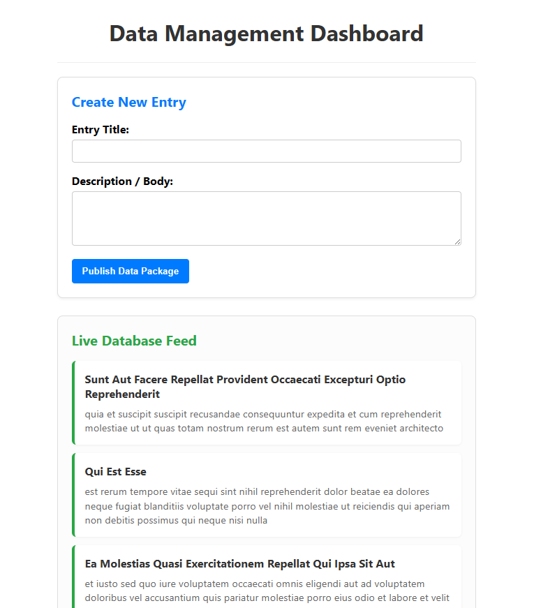

# Product Hub

An Angular application built as coursework for my Full-Stack Web
Development Diploma (2026).

## What it demonstrates

- Component architecture with parent-child data flow via `@Input()`
- Template iteration using Angular's `@for` block syntax
- `HttpClient` integration against a REST API ([which API, e.g.
  "a mock products endpoint" or the real one])
- [anything else it genuinely covers - routing, forms, services]

## Stack

Angular [version - check package.json] · TypeScript · [CSS / whatever]

## Running it

    npm install
    ng serve

Then open http://localhost:4200.

## If I were extending it

- Move the hardcoded API URL into environment configuration
- [one or two more - pagination, error handling on the HTTP calls,
  tests, whatever you actually noticed while reviewing it]

## Screenshot

